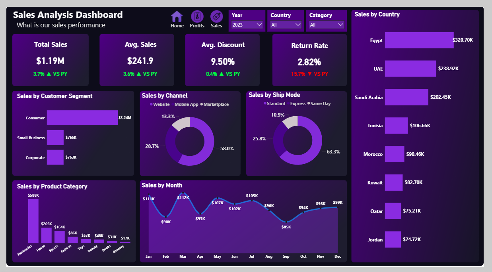
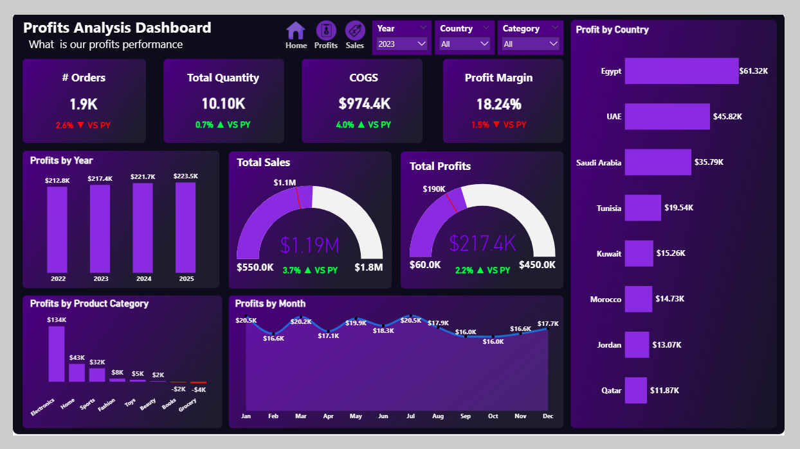

# 📊 Sales & Profit Project (Power BI)

## 📌 Project Overview

This project presents a **Power BI solution** consisting of two interactive dashboards designed to analyze both **sales performance** and **profits Performance**.

* 📈 **Sales Dashboard** – Tracks sales trends, channel behavior, market performance and more
* 💰 **Profit Dashboard** – Focuses on COGS, profit margin, profits distribution and more

Together, they provide a complete view of **business performance (Top-line & Bottom-line)** to support data-driven decision-making.

## 🎯 Objectives

* Monitor and evaluate key KPIs
* Identify top-performing countries and product categories
* Analyze sales channels and shipping methods
* Understand profitability drivers and cost impact

## ⚙️ Key Features

* 🔍 Interactive slicers (**Year, Country, Category**)
* 📊 KPI cards with **Year-over-Year (YoY) comparison**
* 🌍 Sales & profit distribution by country
* 📦 Category-level performance analysis
* 📈 Monthly and yearly trends
* 🚚 Shipping mode & sales channel insights

## 📈 Sales Dashboard — Key Insights (For the selected year = 2023)

* **Consistent Growth**: Sales increased from **$1.15M (2022)** to **$1.19M (2023)**
* **Top Market**: Egypt leads sales, followed by UAE and Saudi Arabia
* **Main Channel**: Website contributes ~58% of total sales
* **Shipping Preference**: Standard shipping dominates (~63%)
* **Top Category**: Electronics is the highest revenue generator
* **Seasonality**:

  * Peaks in **January & March**
  * Noticeable drop in **September**

## 💰 Profit Dashboard — Key Insights (For the selected year = 2023)

* **Profit Growth**: Increased from **$212K (2022)** to **$217K (2023)**
* **Profit Margin**: Decreased from **18.5% (2022)** to **18.2% (2023)**with almost a stable performance
* **Top Profit Market**: Egypt generates the highest profit
* **Category Performance**:

  * Electronics is the most profitable
  * Losses observed in **Books and Grocery** ❗
* **Monthly Trend**:

  * Strong in **January, March, and Julie**
  * Decline in **September and October**

## 🧠 Business Recommendations

* Scale high-performing categories like **Electronics**
* Reassess pricing or strategy for loss-making categories
* Focus marketing efforts during peak months
* Optimize **COGS** to improve profit margins
* Strengthen underperforming channels (Mobile App & Marketplace)

* ## 📷 Project Preview
* Home Page

* Sales Dashboard

* Profits Dashboard

## 🎥 Interactive Video

👉 **[Watch Full Video](https://drive.google.com/file/d/1KuncO6WwxO7AmcnHc-b_KqaCWbcZIfix/view?usp=drivesdk)**

## 🛠 Tools & Technologies

* **Power BI**

  * Data Modeling
  * DAX Measures
  * Interactive Visualizations
* **Power Query**
  * Data Cleaning & Transformation
* **Figma*
  * Dashboard Design

## 📎 How to Use

1. Open the `.pbix` file using Power BI Desktop
2. Use slicers to filter data dynamically
3. Navigate between:

   * Sales Dashboard
   * Profit Dashboard

## 👤 Author
**Raed Ahmed**

⭐ If you found this project useful, don't forget to star the repo!

